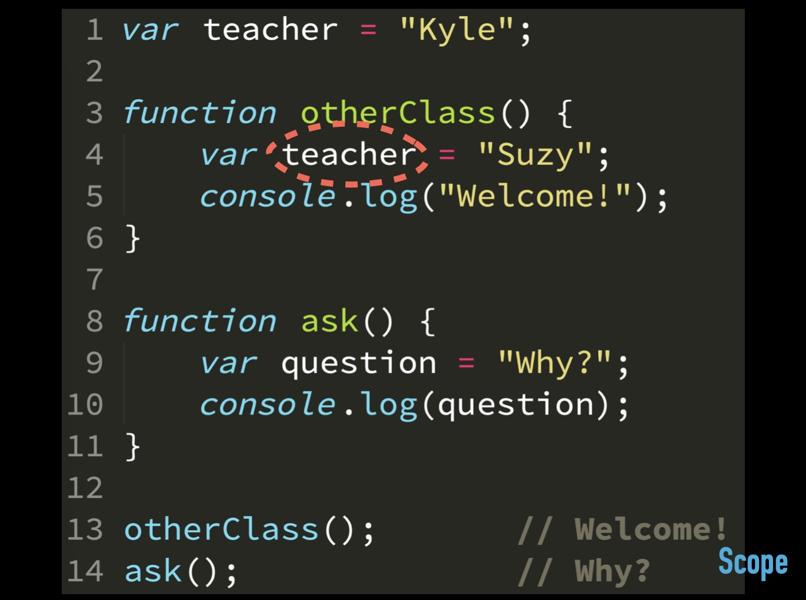

# Compilation & Scopes

One metaphor effective in understanding scope is sorting colored marbles into buckets of their matching color.

Imagine you come across a pile of marbles, and notice that all the marbles are colored red, blue, or green. To sort all the marbles, let's drop the red ones into a red bucket, green into a green bucket, and blue into a blue bucket. After sorting, when you later need a green marble, you already know the green bucket is where to go to get it.

In this metaphor, the marbles are the variables in our program. The buckets are scopes (functions and blocks), which we just conceptually assign individual colors for our discussion purposes. The color of each marble is thus determined by which color scope we find the marble originally created in.

### Understanding the scoping during compilation :
Lines 1, 3, 8 - Red marbles
Line 4 - Blue marble
Line 9 - Green marble

##### *Note* :
All lexical scopes are decided during compile time. Only the formal declarations (vars, function abc(), etc.) are the marbles considered during compilation. Rest of the statements are executed during runtime stage.

